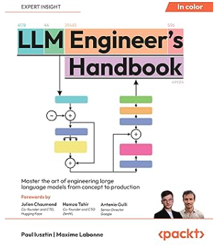
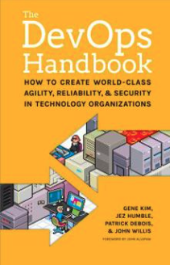
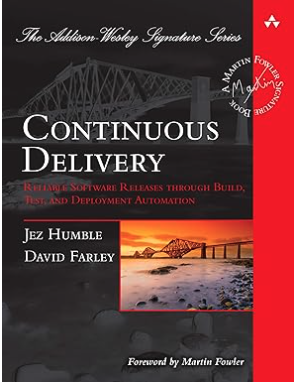
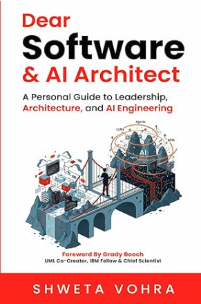
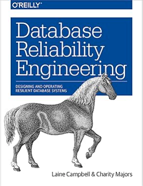
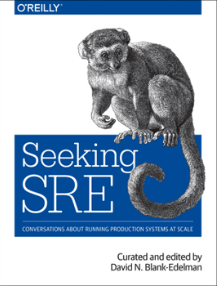
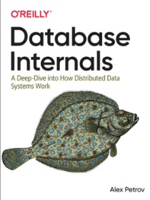
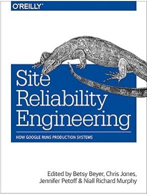
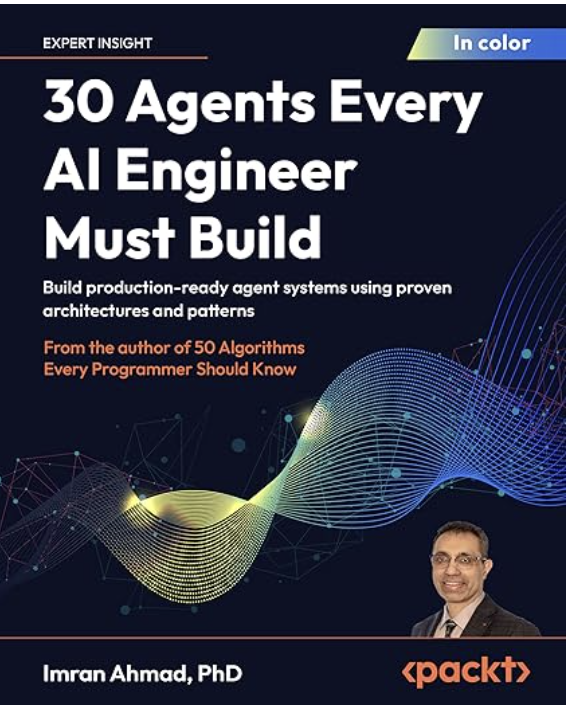
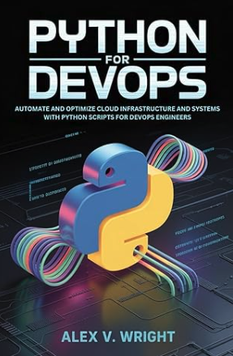

# Continuous Learning

### AI

- [LLMOps with DATABRICKS  - Maria Vechtomova (Cauchy)](llmops-with-databricks-maria-vechtomova-cauchy.md)

- [AI Solutions Architect  - Dr. Duc Haba  (ELVTR)](ai-solutions-architect-dr-duc-haba-elvtr/index.md)

- [Machine Learning DevOps Engineer Nanodegree - Udacity](machine-learning-devops-engineer-nanodegree-udacity.md)

- [Machine Learning in Production - Andrew Ng  (DeepLearning.ai)](machine-learning-in-production-andrew-ng-deeplearning-ai.md)

- [AI Practitioner - AWS](ai-practitioner-aws.md)

### SRE

- [GitOps Certified with ARGO - Codefresh - 2024](gitops-certified-with-argo-codefresh-2024.md)

- [Certified Kubernetes Administrator (CKA) - Linux Foundation - 2024](certified-kubernetes-administrator-cka-linux-foundation-2024.md)

- [Prometheus Certified Administrator - Linux Foundation - 2023](prometheus-certified-administrator-linux-foundation-2023.md)

- [Cloud & Devops Continuous Transformation - MIT - 2021](cloud-devops-continuous-transformation-mit-2021.md)

- [CKAD - Linux Foundation - 2021](ckad-linux-foundation-2021.md)

- [Terraform Associate - Hashicorp - 2020](terraform-associate-hashicorp-2020.md)

- [Solutions Architect Associate - AWS - 2020](solutions-architect-associate-aws-2020.md)

- [Databases & Data Analytics Certification - UC Santa Cruz extension  - 2017](databases-data-analytics-certification-uc-santa-cruz-extension-2017.md)

Recommended books:

-   
    
    
    
    
    

-   
    
    
    
    

-   
    
    
    

Recommended Podcasts:

1. [Super Data Science](https://www.superdatascience.com/podcast)

2. [Everyday AI](https://www.youreverydayai.com/)

3. [To Be Continuous](https://www.heavybit.com/library/podcasts/to-be-continuous/?ref=devopscube.com)

4. [MLOps Community ](https://home.mlops.community/home/events)

5. [The Pragmatic Engineer ](https://newsletter.pragmaticengineer.com/)

Following:

1. [Agentic AI Foundation](https://aaif.io/) 

2. [Decoding AI ](https://www.decodingai.com/)(Paul Iusztin)

3. [Andrej Karpathy](https://karpathy.ai/)

4. [DeepLearning.ai](http://DeepLeatning.ai) (Andrew Ng)

5. [Marvelous MLOps (](https://www.marvelousmlops.io/)Maria Vechtomova)

6. [Databricks](https://www.linkedin.com/in/semaan/) (Viktoria Semaan)

7. [OpenAI News](https://openai.com/news/) 

8. [Duc Haba](https://www.linkedin.com/in/duchaba/)

9. [Alex Banks](https://www.linkedin.com/in/a-banks/)

10. [Ed Donner](https://www.linkedin.com/in/eddonner/)

11. [DevopsCube](https://discuss.devopscube.com/?ref=devopscube.com)

12. [Zapier](https://www.linkedin.com/in/migueloteropedrido/) (Miguel Otero)

13. [IaC Conf](https://www.iacconf.com/events)

14. [Anthropic Engineering](https://www.anthropic.com/engineering)

15. [DevOps.com](http://DevOps.comhttps://devops.com/?ref=devopscube.com)

16. [Cloud Nativos](https://www.youtube.com/@cloudnativo/videos)
