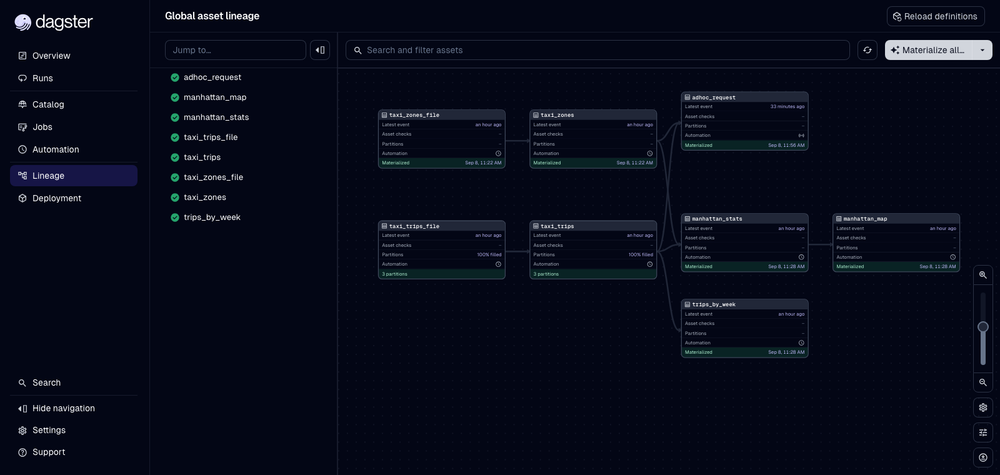
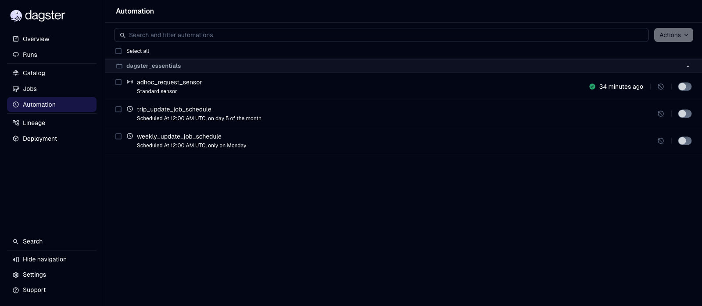

# Dagster - NYC Taxi Data Pipeline

- September 2026

An end-to-end, **asset-oriented data pipeline** built with [Dagster](https://dagster.io/) 1.13: it
ingests the NYC Taxi & Limousine Commission trip records, loads them into DuckDB, and produces
analytics outputs (a Manhattan choropleth map, weekly trip aggregates, and charts answering ad-hoc
business requests). Built while completing **Dagster Essentials** from
[Dagster University](https://courses.dagster.io/).

- [Pipeline code - `dagster_essentials/defs`](https://github.com/JoseMorei/project-dagster-university/tree/main/dagster_university/dagster_essentials/src/dagster_essentials/defs)

## What it does

Every step is modelled as a **software-defined asset** - a declarative description of a table, file
or chart that should exist - instead of an imperative task. Dagster derives the dependency graph
from those declarations, so the lineage below is not drawn by hand, it *is* the code:



| Asset | What it produces |
| --- | --- |
| `taxi_trips_file` | Raw monthly trip Parquet pulled from the NYC Open Data CDN |
| `taxi_zones_file` | Raw taxi zone lookup CSV (zone, borough, geometry) |
| `taxi_trips` | `trips` table in DuckDB, partitioned by month |
| `taxi_zones` | `zones` table in DuckDB |
| `manhattan_stats` | Trips per taxi zone, joined to zone geometry, written as GeoJSON |
| `manhattan_map` | Choropleth PNG of trip volume per Manhattan zone (GeoPandas + Matplotlib) |
| `trips_by_week` | Weekly rollup of trips, revenue, distance and passengers as CSV |
| `adhoc_request` | Stacked bar chart answering a borough/date-range request supplied as run config |

## Partitions and idempotent loads

`taxi_trips_file` and `taxi_trips` are backed by a `MonthlyPartitionsDefinition`, so each month is
materialized, retried and backfilled independently. The DuckDB load is written to be safely
re-runnable - the partition's rows are deleted before insert, so re-materializing a month never
double-counts:

```python
delete from trips where partition_date = '{month_to_fetch}';

insert into trips
select
  VendorID, PULocationID, DOLocationID, RatecodeID, payment_type, tpep_dropoff_datetime,
  tpep_pickup_datetime, trip_distance, passenger_count, total_amount, '{month_to_fetch}' as partition_date
from '{constants.TAXI_TRIPS_TEMPLATE_FILE_PATH.format(month_to_fetch)}';
```

DuckDB itself is injected as a **resource** (`DuckDBResource`) configured from an environment
variable, so no connection string is hardcoded in an asset and the same graph can point at a
different database per environment.

## Automation



- **`trip_update_job_schedule`** - runs the monthly-partitioned `trip_update_job` on the 5th of each
  month, once the previous month's TLC data has been published.
- **`weekly_update_job_schedule`** - refreshes the weekly aggregates every Monday.
- **`adhoc_request_sensor`** - watches a `data/requests/` directory for JSON files. Each new or
  modified file becomes a `RunRequest` with a `run_key`, so a request is answered exactly once; file
  modification times are persisted in the sensor **cursor** between ticks.

The three jobs are defined as *asset selections* rather than duplicated task lists -
`trip_update_job` is literally "everything except the weekly rollup and the ad-hoc request":

```python
trip_update_job = dg.define_asset_job(
    name="trip_update_job",
    partitions_def=monthly_partition,
    selection=dg.AssetSelection.all() - trips_by_week - adhoc_request
)
```

## Stack

Dagster 1.13 · DuckDB · Pandas · GeoPandas · Matplotlib · Python · `uv` · GitHub Codespaces
