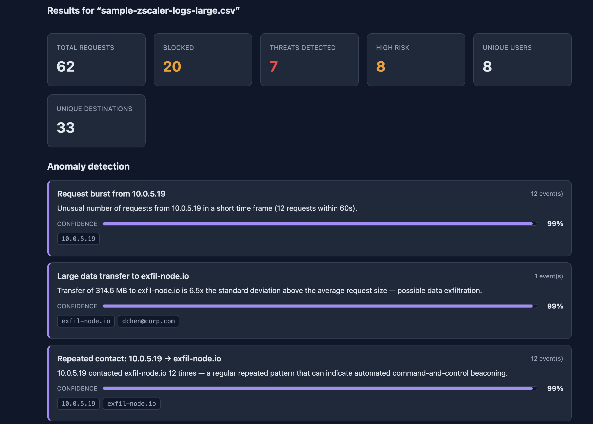
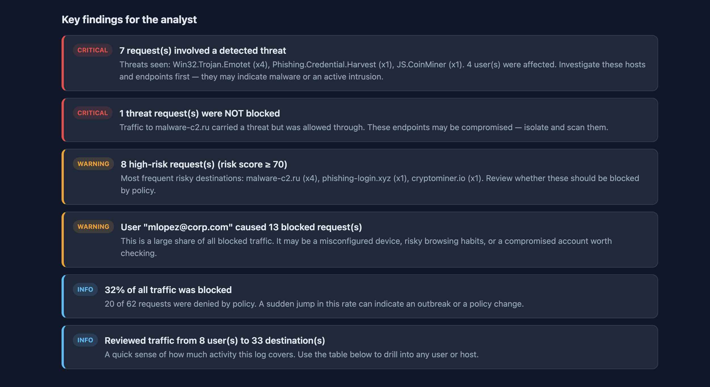
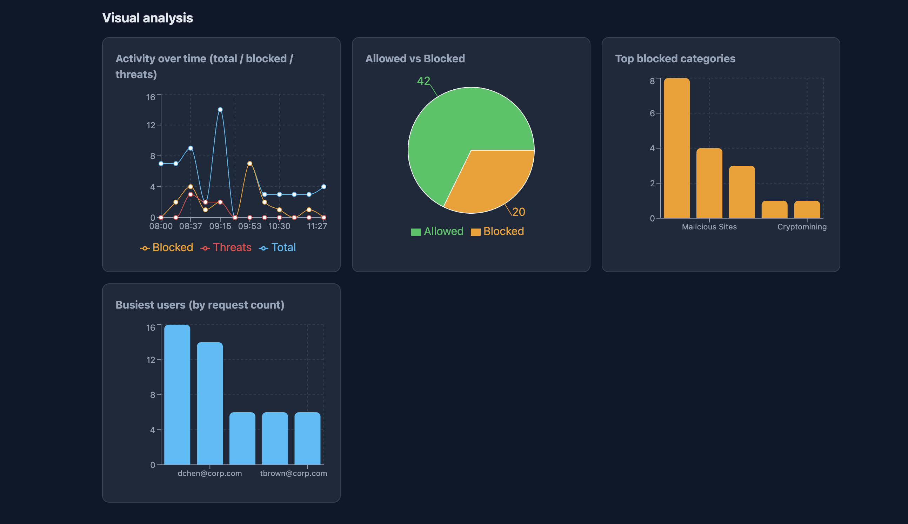

# Web app for Security Operations Center (SOC) log analysis

Log in, upload a **ZScaler Web Proxy** log file, and read an easy-to-understand security analysis: headline numbers, AI-based threat detection, plain-English findings, charts, a searchable detail table, and a history of previous uploads.

[GitHub Repo](https://github.com/JoseMorei/soc_log_analyzer)

[App Public Access](https://socanalyzer.netlify.app/)

